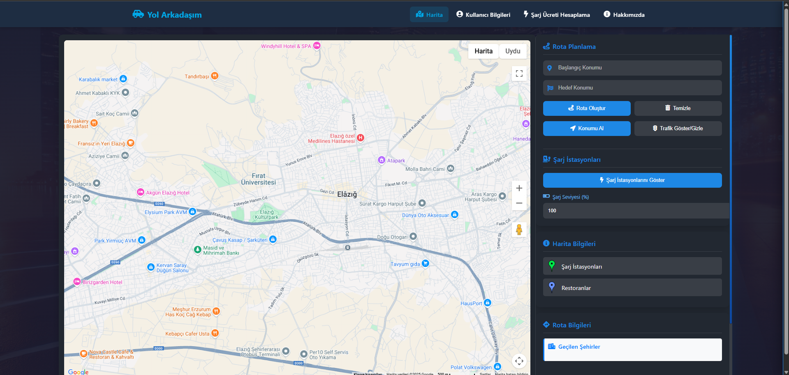
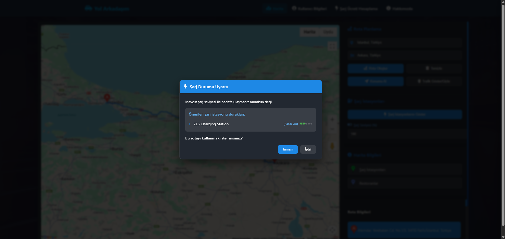
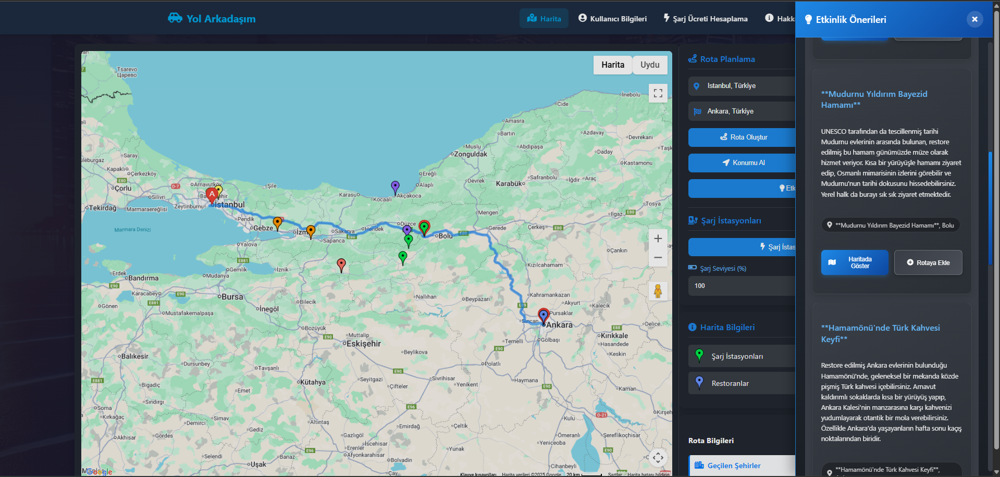
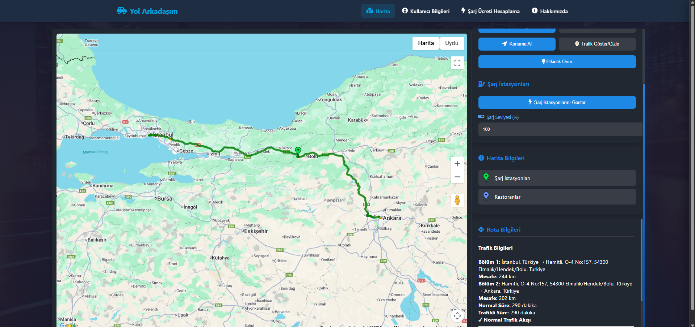
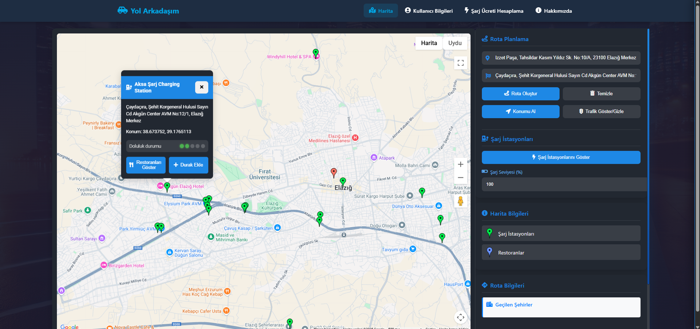
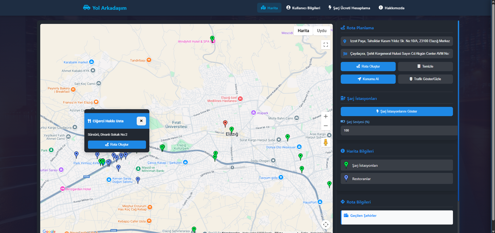
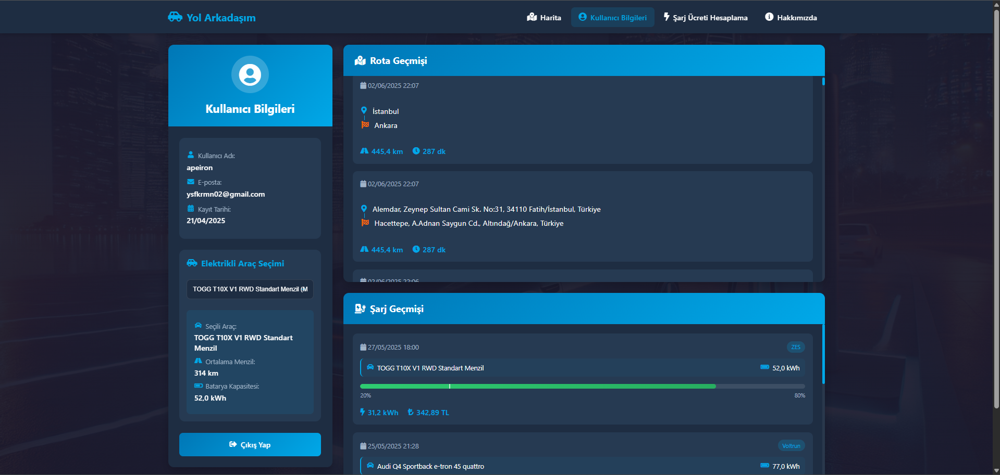
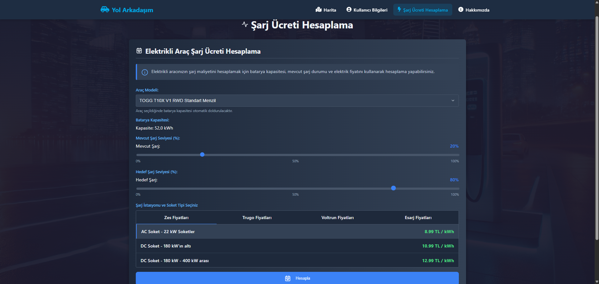

# Yol Arkadaşım - Elektrikli Araç Rota Planlayıcı

## 📱 Proje Hakkında
Yol Arkadaşım, elektrikli araç kullanıcıları için özel olarak tasarlanmış, rota planlama ve şarj istasyonu bulma uygulamasıdır. Kullanıcıların elektrikli araçlarına özel rotalar oluşturmasına, şarj istasyonlarını görüntülemesine ve yolculuk planlamasına olanak sağlar.

## 🛠️ Kullanılan Teknolojiler
- **Backend Framework:** Django
- **Veritabanı:** SQLite
- **Frontend:** HTML, CSS, JavaScript
- **Harita Entegrasyonu:** Google Maps API
- **Kimlik Doğrulama:** Django Authentication System

## ✨ Temel Özellikler
- 🗺️ Elektrikli araçlara özel rota planlama
- 🔌 Şarj istasyonu konumları ve detayları
- 🚗 Araç bazlı menzil hesaplama
- 👤 Kullanıcı profil yönetimi
- 💰 Şarj ücreti hesaplama
- 📱 Responsive tasarım

## 🖼️ Ekran Görüntüleri

### Harita Sayfası

*Harita üzerinde rota planlama ve şarj istasyonu görüntüleme*


*Rota detayları ve menzil bilgisi görüntüleme*


*Şarj istasyonu detayları ve kullanılabilirlik durumu*


*Alternatif rota seçenekleri*


*Şarj istasyonu filtreleme ve arama*


*Rota özeti ve tahmini varış süresi*

### Kullanıcı Arayüzü

*Kullanıcı profil ve tercih yönetimi*


*Şarj ücreti hesaplama ve ödeme seçenekleri*


*Kullanıcı giriş ve kayıt ekranı*

## 🚀 Kurulum

1. Projeyi klonlayın:
```bash
git clone https://github.com/kullaniciadi/yol-arkadasim.git
```

2. Sanal ortam oluşturun ve aktifleştirin:
```bash
python -m venv .venv
source .venv/bin/activate  # Linux/Mac için
.venv\Scripts\activate     # Windows için
```

3. Gerekli paketleri yükleyin:
```bash
pip install -r requirements.txt
```

4. Veritabanı migrasyonlarını yapın:
```bash
python manage.py migrate
```

5. Geliştirme sunucusunu başlatın:
```bash
python manage.py runserver
```

## 📝 Lisans
Bu proje MIT lisansı altında lisanslanmıştır. Detaylar için [LICENSE](LICENSE) dosyasına bakınız.

## 👥 Katkıda Bulunma
1. Bu depoyu fork edin
2. Yeni bir branch oluşturun (`git checkout -b feature/yeniOzellik`)
3. Değişikliklerinizi commit edin (`git commit -am 'Yeni özellik: Açıklama'`)
4. Branch'inizi push edin (`git push origin feature/yeniOzellik`)
5. Pull Request oluşturun
